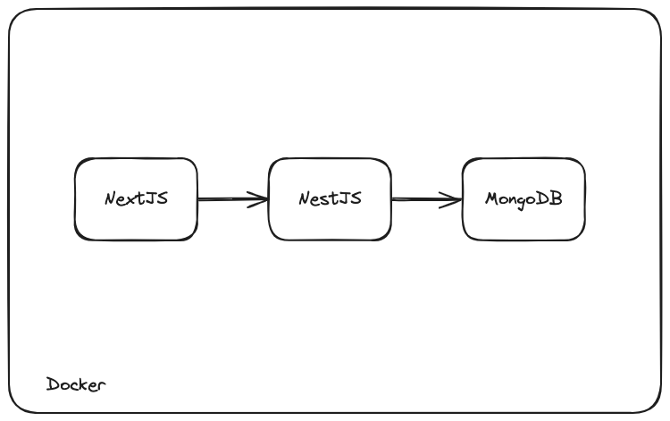
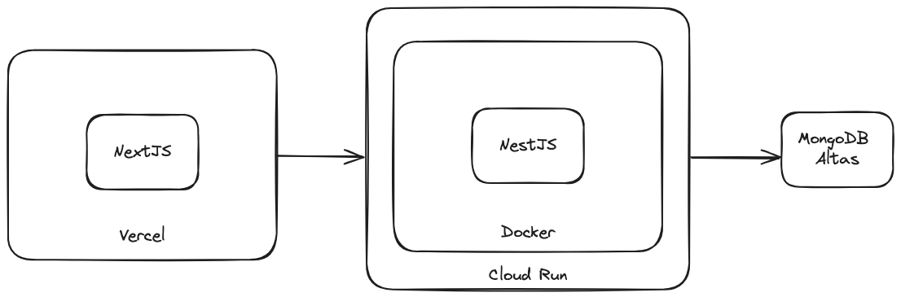

# Expense Tracker

## Motivation

I am currently using a personal finance application called Fortune City. I like its functionality and UI, but the startup time is slow.

## Demo

[**Try out the demo!**](https://expense-tracker-six-blush.vercel.app/)

## Functionalities

|     Functionality     | To Do | In Progress | Completed |
| :-------------------: | :---: | :---------: | :-------: |
|  Google Login/Logout  |       |             |     ✓     |
| Add/Edit/Delete/View Transactions |       |             |     ✓     |

## Architecture

### Local

### Production

## Build and run

### To Run Locally:

Clone the repository and perform below actions:

1. Run `npm install` for both web and backend repository
2. Change `.env.example` to `.env`. Update the value of environment variables
3. In root repository, run `docker-compose up -d --build`. For more information, please check docker official document
4. Open http://localhost:3000 in browser.

Please note that the web url and backend url would be http://localhost:3000 and http://localhost:3001

### To Build:

Run `npm run build` for both web and backend repository

## Tech Stacks

### Frontend

- NextJS
- Tailwind CSS
- Headless UI

### Backend

- NestJS

### Database

- MongoDB
- Mongoose

### Containerization

- Docker

### Cloud

GCP is used in this project, services including

- Cloud Build
- Cloud Run
- Artifact Registry
- Secret Manager
